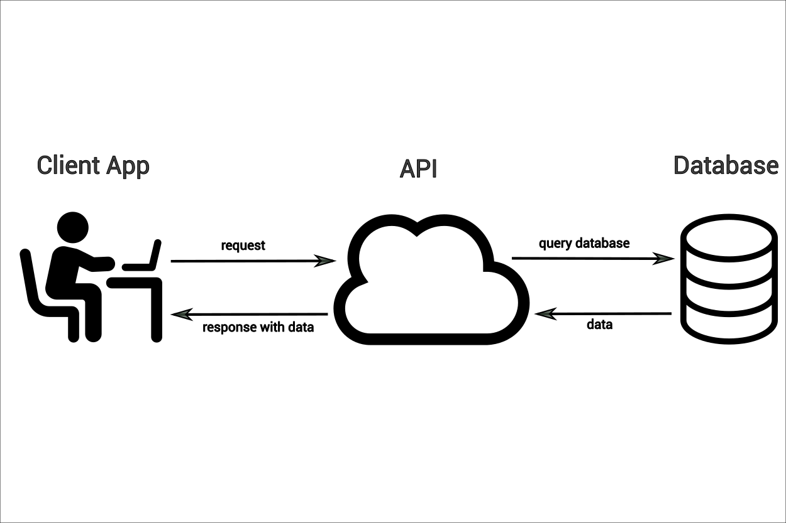

# API

# API = Application programming interface
# How software can communicate with one another.

import requests
import json

# open apis= accessible for public; private apis= unavailable to public.

# post_codes_req = requests.get("https://api.postcodes.io/postcodes/se120nb")
# .get = requests all the data
# print(post_codes_req) # outputs <Response [200]> because
#
# print(post_codes_req.status_code) # outputs 200
#
# print(post_codes_req.headers) # prints raw http headers
#
# print(post_codes_req.content) # raw data that makes the content
#
# print(post_codes_req.json()) #data in json = easier to use and manipulate.
#
# print(type(post_codes_req.json())) # outputs <class 'dict'>
# ctrl + z = undo

json_body = json.dumps({"postcodes": ["PR8 5DB", "M45 6GN", "EX165BL"]}) # .dumps set a the data we want to send to an api
headers = {"Content-Type": "application/json"}

post_multi_req = requests.post("https://api.postcodes.io/postcodes", headers=headers, data=json_body)
# .post = requests only info on the data we mentioned (the postcodes we mentioned on our variable.
print(post_multi_req.json())